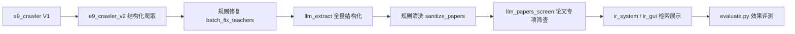

# IR System

一个面向苏州大学导师信息的轻量检索系统，提供 CLI 与 GUI 两种使用方式。

## 更新与功能

- 多次迭代查询: 先尝试精确短语匹配, 若无结果再放宽为分块/词项检索.
- 放宽查询条件: 例如 "机器翻译" 可自动降级为 "机器" 或 "翻译" 的组合检索.
- 可选模糊查询: 当存在 `fuzzywuzzy` 依赖时, 进行字符串模糊匹配以提升召回.
- 字段限定检索: `姓名: / 研究方向: / 论文:` 前缀可将检索范围限定到对应字段, 提升精确度.
- 结果清洗去冗余: 自动剥离语料元数据头(doc_id/url 等)、裁剪页面模板与页脚(基本信息/版权所有 等)、折叠多余空白, 并对研究方向/简介/论文做长度截断.
- 片段智能去重: 当片段内容与已展示字段重复时自动隐藏.
- 命中关键词高亮: 仅保留最长非重叠匹配词(如 "周国栋" 不再附带 "周国"/"栋" 碎片).
- 更稳健脱敏: 邮箱需带合法域名(避免误伤 "@Google Scholar"), 电话仅匹配手机号/带分隔符座机(避免误伤课题编号与年份区间).

## 功能概览

- TF-IDF 词项打分与结果排序.
- 支持姓名/研究方向/论文等信息检索.
- GUI 过滤器: 姓名/研究方向/论文条件组合.
- GUI 增强: 快捷查询、基础/优化模式切换、Top-K 可调、按相关度/姓名/学院排序、状态栏耗时反馈、一键打开教师主页。
- GUI 美化: 卡片式结果、序号徽章、相关度徽章、字段标签对齐、命中关键词彩色标签、分隔线与滚轮滚动。
- 基础 vs 优化并排对比: 点击「基础 vs 优化 对比」按钮, 弹出双栏窗口同屏比较两套配置的结果, 标注各自命中数/耗时, 并用绿色「优化新增」标签高亮优化模式额外召回的导师。

## 使用方式

1. 命令行: 运行 `python ir_system.py`.
2. 图形界面: 运行 `python ir_gui.py`.
3. 效果对比评测: 运行 `python evaluate.py`.

## 依赖

- 标准库: `json`, `math`, `os`, `re`, `tkinter`
- 第三方:
  - `ttkbootstrap`
  - `fuzzywuzzy` (可选, 启用模糊查询)

## 说明

- 语料位于 `crawled_data/corpus`.
- 教师元数据位于 `crawled_data/teachers.json`.
- 爬虫脚本: `crawler/e9_crawler.py`（V1）, `crawler/e9_crawler_v2.py`（V2 高质量版）。

## 高质量爬虫 V2（crawler/e9_crawler_v2.py）

针对 V1 数据中“研究方向只抓到引导词/标签、片段混入导航菜单、保存乱码”等问题重写：

- 结构化抽取: 按页面模块 `div.post.mbox`（标题 `.tt .tit` + 正文 `div.con`）精准取栏目内容, 不再对整页扁平文本硬切。
- 多页站点跟进: 自建主页(如 `jy_zhou/index.html`)若研究/论文拆到子页面(`research.html`/`papers.html`), 自动顺着「科研/论文/简介」链接抓取并补齐。
- 英文主页适配: 支持 `Biography / Research / Publications` 等英文栏目标题(如赵朋朋英文主页)。
- 标题别名适配: 兼容 `个人简历 / 个人概况` 等非标准栏目名(如曹敏)。
- 强力清洗: 去导航行/空标签行/访问计数/重复段落, 折叠空白, 归一化不间断空格; 扁平分节会在「社会兼职/招生信息」等非目标标题处截断, 避免串栏。
- 字段校验: 研究方向/简介/论文若仅剩残缺标签(如 `研究方向：`)判定为缺失并置空。
- 全量摘录: 每位老师把主页+子页面的干净全文存入记录字段 `full_text`(已脱敏), 供大模型抽取阶段使用, 做到不丢信息。
- 健壮编码: 响应头 charset → meta charset → utf-8 → gb18030, 修复保存乱码。
- 质量报告: 输出 `crawled_data/quality_report.json`, 统计各字段完整率并列出缺失项。

## 大模型结构化抽取（crawler/llm_extract.py，可选增强）

各教师主页栏目命名差异极大（研究领域/Research/会议论文/期刊论文…），关键词匹配易漏。
该脚本把爬虫存的 `full_text` 整体交给大模型，统一抽取 研究方向/简介/代表论文/关键词，
不依赖固定栏目名；属“规则保底 + LLM 增强”：

- 发送前再次脱敏；输出严格 JSON 带容错解析；限速/重试/退避；缓存(已抽取跳过, `--force` 重抽)。
- 没有 API key 或调用失败时自动回退保留规则版结果, 不清空已有数据。
- 抽取后回写 `teachers.json` 并重建语料/索引, IR 系统可直接使用。

依赖与环境变量（DeepSeek，OpenAI SDK）:

- `pip install openai`
- `DEEPSEEK_API_KEY`(必填，兼容旧名 `LLM_API_KEY`)、`LLM_BASE_URL`(默认 `https://api.deepseek.com`)、`LLM_MODEL`(默认 `deepseek-v4-pro`)。
- 默认开启 DeepSeek V4 Pro 思考模式(`reasoning_effort=high` + `thinking.enabled`)，可用 `--no-thinking` 关闭以提速省钱。

```powershell
$env:DEEPSEEK_API_KEY="sk-xxx"
python crawler/llm_extract.py --limit 5      # 先小批量试抽
python crawler/llm_extract.py                # 全量抽取并回写
python crawler/llm_extract.py --dry-run      # 只打印不回写
python crawler/llm_extract.py --no-thinking  # 关闭思考模式
```

### 研究方向从简介回填（规则保底，无需 API）

部分老师把研究方向写在“个人简介”里（如“研究兴趣集中在…/主要从事…研究”）。
爬虫与 `llm_extract.py` 会在研究方向缺失时，从简介中按高精度规则抽取并过滤教学/联系等噪音：

```powershell
python crawler/llm_extract.py --rules-only   # 无需 key，从简介回填研究方向并重建语料
```
- 温和反爬: 随机间隔(4–7s)、分批长休息、429/503 指数退避并尊重 `Retry-After`、403 退避重试、仅抓 `suda.edu.cn` 静态主页。

运行方式（建议先小批量试跑）:

```powershell
# 清掉本地代理干扰
$env:HTTP_PROXY=''; $env:HTTPS_PROXY=''
cd "e:\信息检索\github_IR\IR_System"

# 1) 先试跑前 10 位, 确认数据质量与反爬正常
python crawler/e9_crawler_v2.py --limit 10

# 2) 确认无误后全量重爬（会重新生成 teachers.json / corpus 等）
python crawler/e9_crawler_v2.py --no-resume
```

说明: V2 只复用带 `parser_version=2` 的记录, 因此首次运行会对旧数据强制重爬以提升质量; 中断后可去掉 `--no-resume` 续爬。

## 评测输出

- `evaluate.py` 会同时评测 baseline（不放宽、不模糊）与 optimized（放宽+模糊）两套检索配置。
- 默认内置 21 条评测查询（姓名/研究方向/字段限定混合）。
- 详细结果默认输出到 `outputs/eval_compare.csv`，包含 `hit@1`、`hit@k`、期望名次、响应时间等字段，可直接用于报告对比表。
- 汇总结果默认输出到 `outputs/eval_summary.csv`，可直接用于画柱状图/表格。
- 每次执行会把“本次做了什么 + 指标摘要”追加写入 `outputs/eval_run_log.md` 作为实验过程日志。

## 一键复现评测

```powershell
python evaluate.py
```

运行后会生成：

- `outputs/eval_compare.csv`（逐查询明细）
- `outputs/eval_summary.csv`（模式汇总）
- `outputs/eval_run_log.md`（运行日志，追加写入）

## 论文专项筛查（crawler/llm_papers_screen.py）

全量 `llm_extract.py` 抽取后，部分教师论文栏仍混入期刊缩写、统计句、审稿职务等噪音（如赵雷主页只有「在 ICDE/TKDE 发表论文」而无具体标题）。本脚本用**极短提示词**单独调用 DeepSeek，只鉴别真实论文并输出结构化字段：

- 返回 `title / venue / year / ccf_rank`，写入 `papers_struct` 与 `papers_text`
- 无具体标题时返回空数组并清空脏数据
- 标记 `papers_screened: true`，支持 checkpoint 与 Ctrl+C 安全保存

```powershell
python crawler/llm_papers_screen.py --name 赵雷          # 单人验证
python crawler/llm_papers_screen.py --suspicious-only   # 仅 14 条疑似噪音
python crawler/llm_papers_screen.py --all               # 全量未筛查记录
python crawler/llm_papers_screen.py --dry-run           # 预览不写回
```

日志：`crawled_data/llm_papers_screen_log.txt`

---

## 实验过程与问题处理记录

本节汇总 IR 综合实践中的主要问题、根因与处理方式，便于写实验报告。

### 流水线概览



### 一、数据采集阶段

| 问题 | 表现 | 处理 |
|------|------|------|
| V1 爬虫栏目切分不准 | 研究方向只剩「研究方向：」标签；导航菜单混入正文；部分页面乱码 | 重写 `e9_crawler_v2.py`：按 `div.post.mbox` 模块抽取；跟进子页面；多编码探测；`full_text` 全量保留 |
| 栏目命名不统一 | 「研究领域 / Research / 个人概况」等各异，规则难覆盖 | 爬虫只做结构化保底；后续用 LLM 读 `full_text` 统一抽取 |
| 反爬与代理 | 本地代理导致请求失败；429/403 | 清空 `HTTP_PROXY`；随机间隔 + 指数退避；仅抓 `suda.edu.cn` |
| 个别页面无法访问 | 瞿剑锋 `jjf2` 返回 403，名录有、正文无 | 保留名录记录，字段标记缺失；339 人入库、338 个 HTML |
| 英文/自建主页 | 赵朋朋英文栏、周国栋子页面论文拆散 | V2 增加英文标题别名与子页链接跟进 |

### 二、检索与展示阶段

| 问题 | 表现 | 处理 |
|------|------|------|
| 查询过严无结果 | 「机器翻译」等复合词查不到 | 多次迭代查询：精确短语 → 分块/词项 → 可选 `fuzzywuzzy` 模糊匹配 |
| 结果冗余难读 | 语料头、页脚版权、重复片段堆在卡片里 | `build_display()` 剥离元数据头、裁剪模板、片段去重、字段长度截断 |
| 高亮碎片 | 「周国栋」同时高亮「周国」「栋」 | 仅保留最长非重叠匹配 |
| 脱敏误伤 | `@Google Scholar`、课题编号被当邮箱/电话 | 邮箱需合法域名；电话仅匹配手机号/带分隔符座机 |
| GUI 论文难展示 | 论文一大段纯文本，无 CCF 等级 | 引入 `papers_struct`（title/venue/year/ccf_rank）；GUI 逐条列表 + A/B/C 彩色 badge |

### 三、结构化抽取（LLM）阶段

| 问题 | 表现 | 处理 |
|------|------|------|
| API 未配置 / Key 无效 | 首次运行 401；无 key 时脚本退出 | 配置 `DEEPSEEK_API_KEY`；失败时保留规则版数据不清空 |
| 全量抽取耗时长 | 339 人 × 思考模式，数小时 | 加 checkpoint（`--checkpoint-every`）；Ctrl+C 安全写回；可用 `--no-thinking` 提速 |
| 全量抽取 1 人失败 | 杨哲 LLM 调用失败，其余 338 人 `llm_extracted` | 保留规则版字段；可 `--name 杨哲 --force` 补抽 |
| 研究方向误抽 | 邝泉声抽到姓名+学院；陈虞苏混入「东南大学」 | 规则过滤姓名/学校/学位占位；`batch_fix_teachers.py` 从 sections 重抽 |
| 简介中有方向、栏为空 | 约 25 人研究方向写在简介里 | `llm_extract.py --rules-only` 从简介按句式回填 |

### 四、论文字段质量（重点）

这是实验中反复出现、迭代最多的部分。

**4.1 典型坏数据类型**

| 类型 | 样例教师 | 坏数据示例 | 处理手段 |
|------|----------|------------|----------|
| 纯期刊/会议缩写 | 赵雷、王中卿 | `ICDE`、`TKDE`、`类国际会议及期刊上发表论文` | `llm_papers_screen.py` 专项筛查 → 清空 |
| 统计/职务句 | 权丽君、杜扬 | 「发表论文 N 篇」「程序委员会成员」 | `_is_paper_line_noise` + LLM 筛查 |
| 占位栏 | 杨璐、曹敏 | `软件著作\n专利` | `batch_fix_teachers.py` 识别占位后清空或从全文提取 |
| dict 字符串 | 丁泓铭 | `{'title': '...', 'venue': '...'}` 写入 `papers_text` | `repair_papers_record()` 解析还原 |
| 基金/课程/招生混入 | 李培峰（部分轮次） | 基金项目名、招生要求进论文栏 | `sanitize_papers_record()` 多模式过滤 |
| 真实论文格式多样 | 李培峰 | `作者: 标题` 或英文长标题 | 筛查时保留；`_looks_like_paper_title` 判断 |

**4.2 处理策略演进**

1. **规则批量修复**（`batch_fix_teachers.py`，无需 API）：占位识别、正则从 `full_text` 抽英文论文标题、生成 `papers_struct`。
2. **LLM 全量抽取**（`llm_extract.py`）：331/332 成功，统一研究方向/简介/论文；内置 `sanitize_papers_record` 后处理。
3. **论文专项筛查**（`llm_papers_screen.py`）：提示词极短、职责单一；先 `--suspicious-only` 清 14 人噪音，再 `--all` 对 324 人全量结构化论文。

**4.3 论文筛查结果（2026-06-09/10）**

- 疑似噪音 14 人：13 人确认为 0 条（主页无具体标题）；**向德辉** 抽出 10 条真实论文（含 venue、ccf_rank）。
- 全量筛查 324 人：成功 324，失败 0；约 **210/339** 人有有效 `papers_struct`。
- **赵雷**：筛查前 `papers_text` 为 ICDE/TKDE 碎片 → 筛查后清空（符合主页仅有统计描述的事实）。

### 五、评测指标演变

内置 21 条查询（姓名 / 研究方向 / 字段限定），`outputs/eval_run_log.md` 追加记录：

| 时间 | baseline hit@1 | optimized hit@1 | 说明 |
|------|----------------|-----------------|------|
| 06-08 初版 | 80.95% | 90.48% | 早期语料，optimized 模糊召回更好 |
| 06-09 数据清洗后 | 85.71% | 85.71% | 去噪音后 baseline 升、optimized 部分查询不再「误召回」 |
| 06-09 论文筛查后 | 85.71% | 85.71% | hit@k 均为 90.48%；数据更干净，指标稳定 |

说明：数据清洗会去掉一些「靠噪音命中」的虚假召回，optimized 模式 hit@1 可能略降，但结果可信度更高。

### 六、当前数据状态（筛查完成后）

| 指标 | 覆盖 |
|------|------|
| 教师总数 | 339 |
| `parser_version=2` | 339 |
| `llm_extracted` | 338（仅杨哲未成功） |
| `papers_screened` | 339 |
| 研究方向 | 297/339（87.6%） |
| 个人简介 | 280/339（82.6%） |
| 有效论文 `papers_struct` | 210/339（61.9%） |

约 129 人论文栏为空属**正常**：主页本身无论文列表，仅有「发表论文 N 篇」类描述，专项筛查刻意不编造标题。

### 七、关键脚本与日志索引

| 脚本 | 用途 | 日志/产出 |
|------|------|-----------|
| `crawler/e9_crawler_v2.py` | 高质量爬取 | `crawl_log.txt`、`quality_report.json` |
| `crawler/batch_fix_teachers.py` | 无 API 批量修复 | 控制台 |
| `crawler/llm_extract.py` | 全量 LLM 结构化 | `llm_extract_log.txt` |
| `crawler/llm_papers_screen.py` | 论文专项筛查 | `llm_papers_screen_log.txt` |
| `evaluate.py` | baseline vs optimized | `outputs/eval_*.csv`、`eval_run_log.md` |
| `ir_gui.py` | 检索 + 结构化论文展示 | — |

### 八、经验小结

1. **爬虫与 LLM 分工**：爬虫保证 `full_text` 完整不丢；LLM 负责语义归一；规则脚本做便宜的高精度过滤。
2. **论文比研究方向更难**：栏目差异大、中英文混排、统计句与真实标题难用单一正则区分 → 专项短 prompt 比全量抽取更稳。
3. **空字段优于脏字段**：赵雷类案例宁可论文为空，也不展示 ICDE/TKDE 缩写，避免检索与 GUI 误导。
4. **可复现**：各环节有 checkpoint、dry-run、限量参数；评测日志自动追加，便于报告引用。
